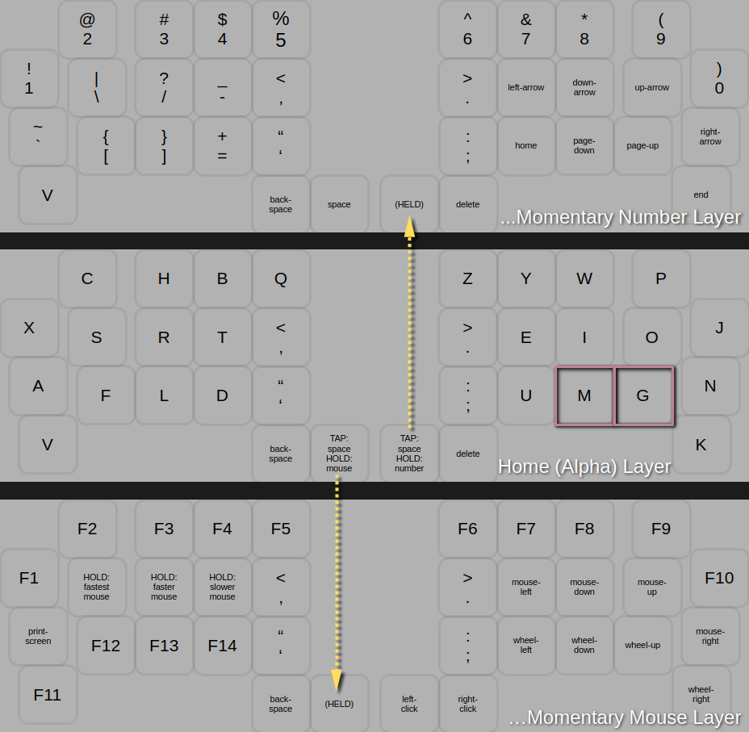
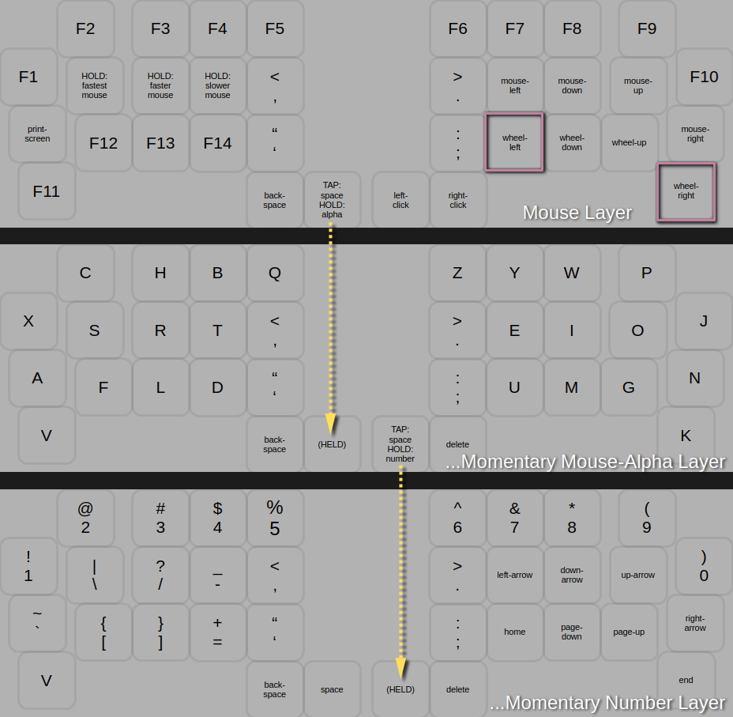
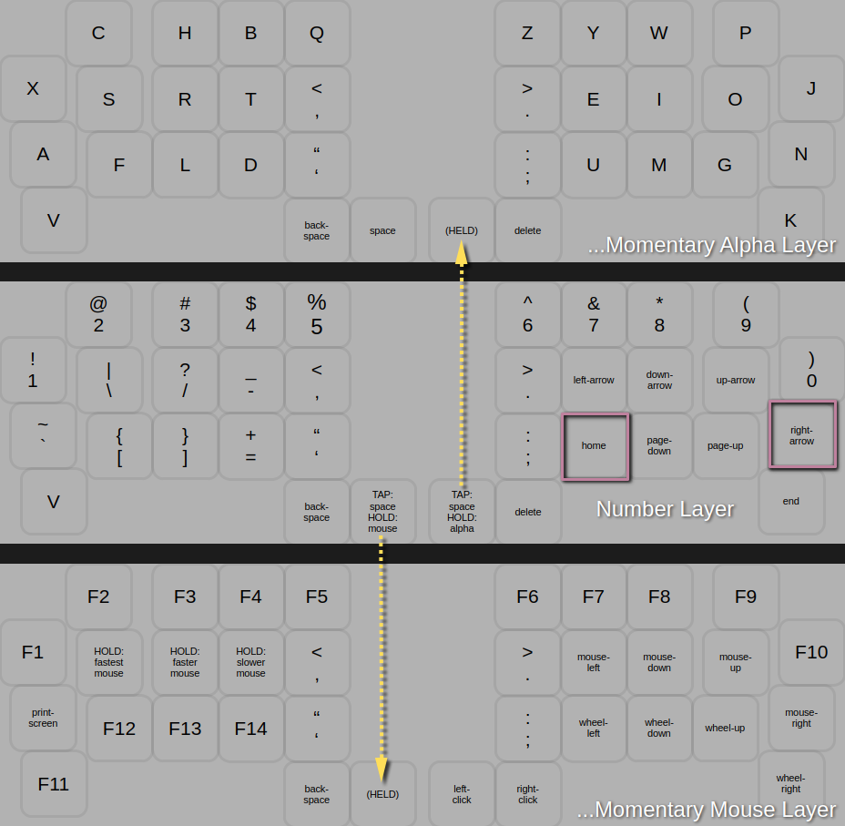
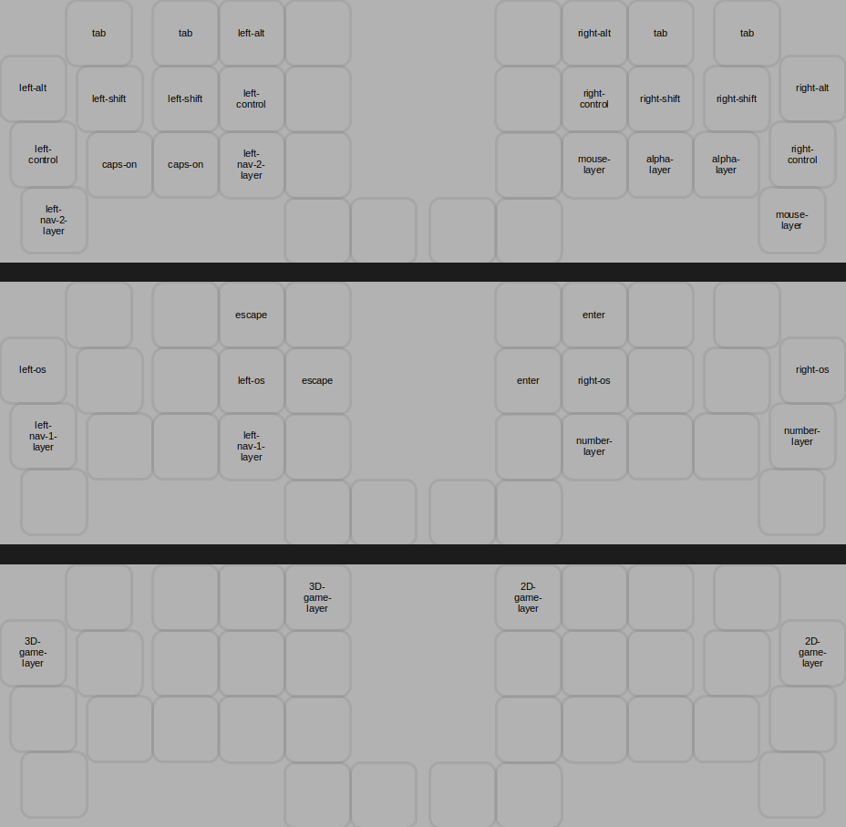
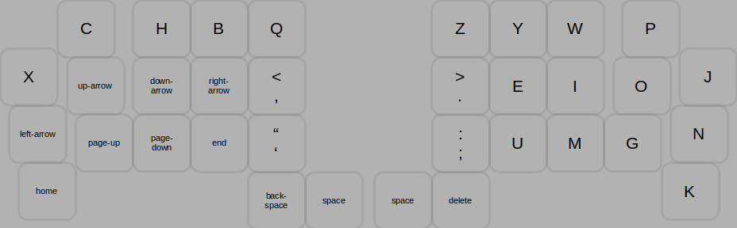
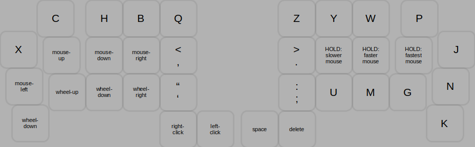
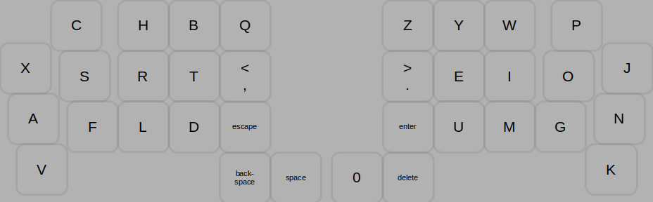
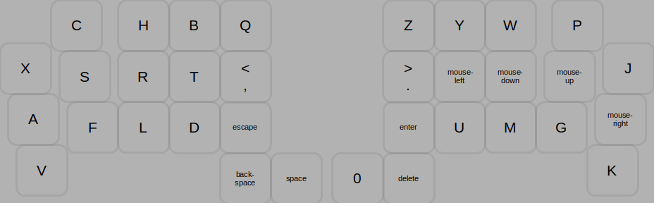

# tomsadowski keymap for pearbear

## alpha layer  
  

## mouse layer  
note: since holding down the left-click button is a common use-case, you must first access the Alpha Layer with the left thumb before accessing the Number Layer with the right thumb.  
  

## number layer  
  

## combos  
the caps-lock combo only turns caps-lock on. Caps-lock is turned off when a modifier or layer-switching combo is pressed.   
  

# extra layers   

## left navigation 1 layer  
contains the navigation keys found in the number layer, but under the left hand.
   

## left navigation 2 layer  
contains the mouse keys found in the mouse layer, but under the left hand.
   

## 2D game layer   
same as alpha layer with the following exceptions:
* combos deactivated
* KC_SPACE replaces HOLD_MOUSE_TAP_SPACE
* KC_0 replaces HOLD_NUMBE_TAP_SPACE
* KC_ESCAPE replaces KC_QUOTE
* KC_ENTER replaces KC_SCLN
  

## 3D game layer   
same as alpha layer with the following exceptions:
* combos deactivated
* KC_SPACE replaces HOLD_MOUSE_TAP_SPACE
* KC_BTN1, KC_BTN2, replaces HOLD_NUMBE_TAP_SPACE, KC_DEL respectively
* KC_MS_L, KC_MS_D, KC_MS_U, KC_MS_R replaces KC_E, KC_I, KC_O, KC_N respectively
  
